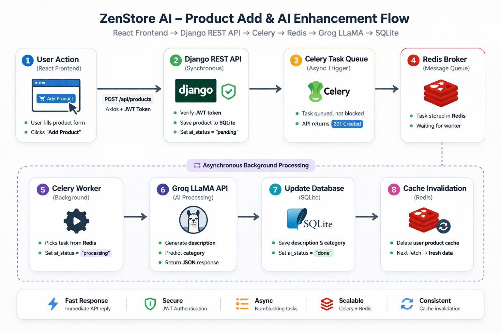
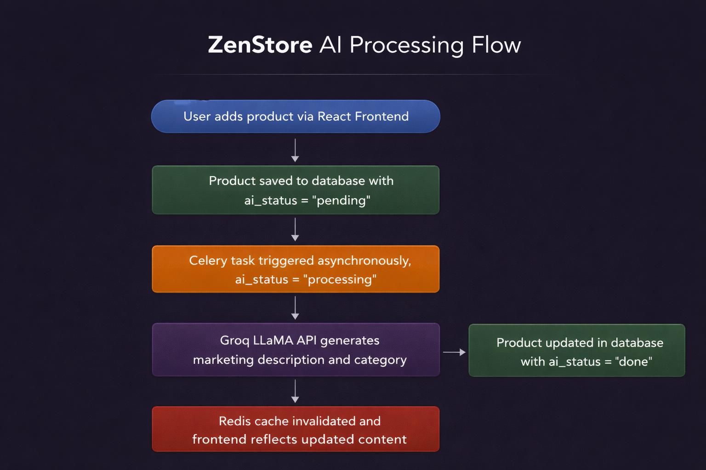
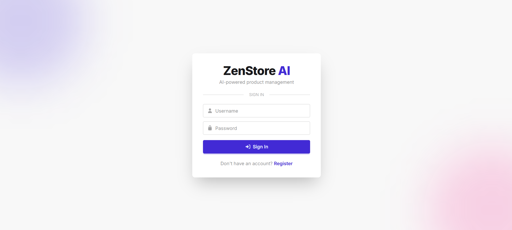
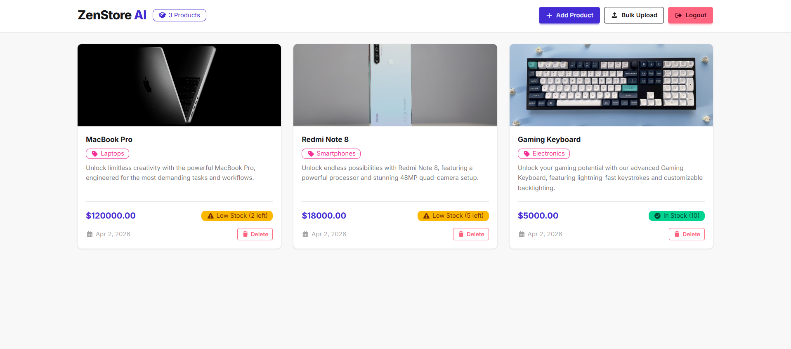
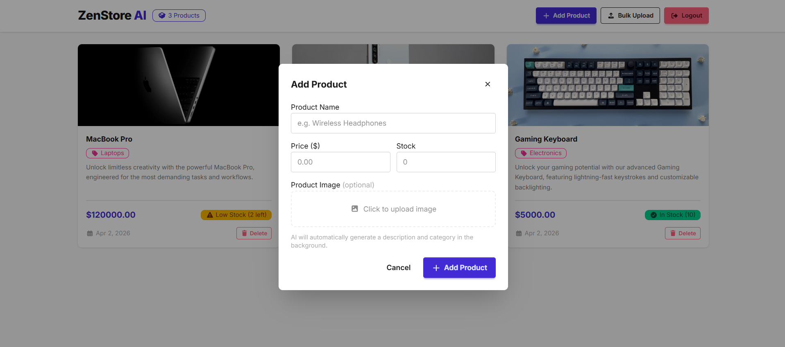
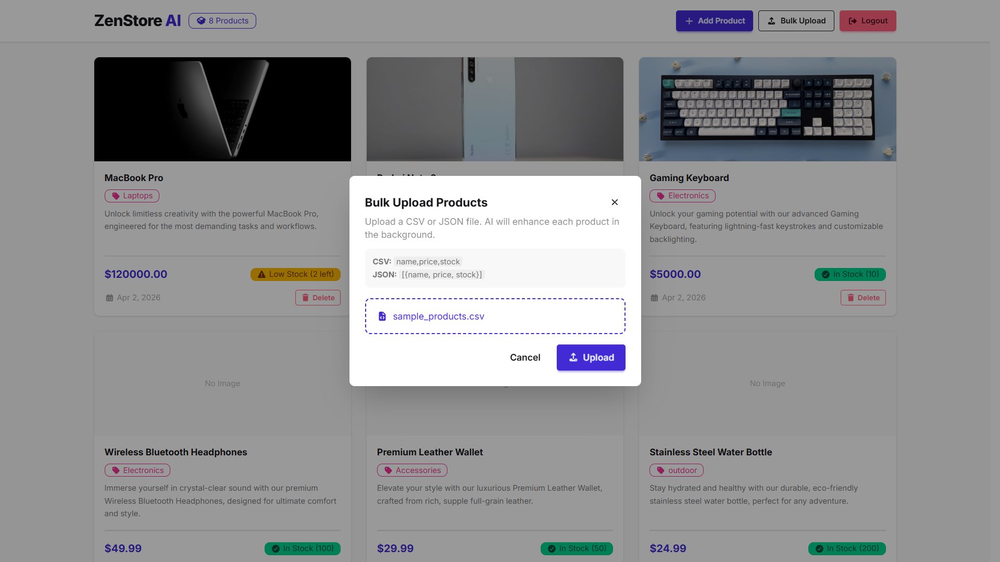

<div align="center">

<h1>ZenStore AI</h1>

<p><i>Add a product name — AI writes the description, picks the category, and handles the rest.</i></p>

</div>

---

## Overview

ZenStore AI is a full-stack product management system where sellers add a product name and price — the rest is handled automatically. A Celery worker calls Groq's LLaMA model to generate a marketing description and category, updating the product in real time.

Built to demonstrate production-grade backend concepts: JWT auth, async task processing, Redis caching, Python generators, custom decorators, and Docker containerization.

---

## Core Features

<div align="center">

| Feature | Description |
|---|---|
| JWT Authentication | Secure register and login, user-scoped data |
| Product CRUD | Full create, read, update, delete |
| AI Enhancement | Groq LLaMA generates catchy description and category |
| Async Processing | Celery workers handle AI tasks without blocking the API |
| Redis Caching | Per-user product cache with automatic invalidation |
| Cloudinary Upload | Cloud-based product image storage |
| Bulk Upload | Upload multiple products via CSV or JSON using Python Generators |
| Swagger Docs | Interactive API documentation |
| Dockerized | Frontend + Backend + Redis containerized |

</div>

---

## Tech Stack

### Backend

<p>
  
  
  
  
  
  
  
  
  
</p>

### Frontend

<p>
  
  
  
  
  
</p>

### DevOps

<p>
  
  
</p>

---

## System Architecture

<div align="center">
  
</div>

---

## AI Processing Flow

<div align="center">
  
</div>

---

## Screenshots

<div align="center">

**Login Page**


<br/>

**Dashboard**


<br/>

**Add Product Modal**


<br/>

**Bulk Upload**


</div>

---

## Installation Guide

### 1. Clone Repository

```bash
git clone https://github.com/nomancsediu/ZenStore-AI.git
cd ZenStore-AI
```

### 2. Setup Environment Variables

```bash
cp .env.example backend/.env
```

```env
SECRET_KEY=your_secret_key
DEBUG=True
REDIS_URL=redis://redis:6379/0
GROQ_API_KEY=your_groq_api_key
CLOUDINARY_CLOUD_NAME=your_cloud_name
CLOUDINARY_API_KEY=your_api_key
CLOUDINARY_API_SECRET=your_api_secret
```

### 3. Run with Docker

```bash
docker-compose up --build
```

| Service | URL |
|---|---|
| Frontend | http://localhost:5173 |
| Backend API | http://localhost:8000 |
| Swagger Docs | http://localhost:8000/api/schema/swagger-ui/ |

---

<div align="center">

**Abdullah Al Noman** · CSE Student · Full Stack Developer

[](https://github.com/nomancsediu)
[](https://linkedin.com/in/nomanit)
[](https://abdnoman.com)

</div>
